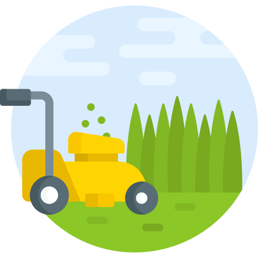

<!-- Improved compatibility of back to top link: See: https://github.com/othneildrew/Best-README-Template/pull/73 -->

<a name="readme-top"></a>

<!--
*** Thanks for checking out the Best-README-Template. If you have a suggestion
*** that would make this better, please fork the repo and create a pull request
*** or simply open an issue with the tag "enhancement".
*** Don't forget to give the project a star!
*** Thanks again! Now go create something AMAZING! :D
-->


<!-- PROJECT SHIELDS -->
<!--
*** I'm using markdown "reference style" links for readability.
*** Reference links are enclosed in brackets [ ] instead of parentheses ( ).
*** See the bottom of this document for the declaration of the reference variables
*** for contributors-url, forks-url, etc. This is an optional, concise syntax you may use.
*** https://www.markdownguide.org/basic-syntax/#reference-style-links
-->


<!-- PROJECT LOGO -->
<br />
<div align="center">
  <a href="https://gitlab.telecomnancy.univ-lorraine.fr/pcd2k24/codingweek-08">
    
  </a>

<h3 align="center">Direct Dealing</h3>

  <p align="center">
    Telecom NANCY - Coding Week 2023
    <br />
    <a href="https://gitlab.telecomnancy.univ-lorraine.fr/pcd2k24/codingweek-08/-/blob/master/README.md"><strong>Explore the docs »</strong></a>
    <br />
    <br />
    <a href="https://gitlab.telecomnancy.univ-lorraine.fr/pcd2k24/codingweek-08">View Demo</a>
    ·
    <a href="https://gitlab.telecomnancy.univ-lorraine.fr/pcd2k24/codingweek-08/-/issues">Report Bug</a>
    ·
    <a href="https://gitlab.telecomnancy.univ-lorraine.fr/pcd2k24/codingweek-08/-/issues">Request Feature</a>
  </p>

</div>


<!-- TABLE OF CONTENTS -->
<details>
  <summary>Table of Contents</summary>
  <ol>
    <li>
      <a href="#about-the-project">About The Project</a>
      <ul>
        <li><a href="#built-with">Built With</a></li>
      </ul>
    </li>
    <li>
      <a href="#getting-started">Getting Started</a>
      <ul>
        <li><a href="#prerequisites">Prerequisites</a></li>
        <li><a href="#installation">Installation</a></li>
      </ul>
    </li>
    <li><a href="#usage">Usage</a></li>
    <li><a href="#roadmap">Roadmap</a></li>
    <li><a href="#contact">Contact</a></li>
  </ol>
</details>


<!-- ABOUT THE PROJECT -->
## About The Project

<div align="center">

</div>

TelecomNancy DirectDealing est une application d’économie circulaire en ligne permettant à des personnes de prêter/emprunter du matériel (tondeuse, marteau-piqueur, épluche-légumes, etc.) et/ou de proposer/demander des services (réparation d’une fuite d’eau, leçon de piano, déménagement, etc.)
<p align="right">(<a href="#readme-top">back to top</a>)</p>


### Built With


<p align="right">(<a href="#readme-top">back to top</a>)</p>


<!-- GETTING STARTED -->
## Getting Started

To properly run the project, you need to have a Java IDE (Eclipse, IntelliJ, etc.) and a Java SDK (OpenJDK, Oracle JDK, etc.) installed on your computer.
You need also to have JavaFX. If you don't have it, you can download it [here](https://gluonhq.com/products/javafx/).

### Prerequisites

There is no prerequisites to run the project.

### Installation

1. Clone the repo
    ```shell
   git clone https://gitlab.telecomnancy.univ-lorraine.fr/pcd2k24/codingweek-08.git
   ``` 
2. Navigate to the project folder
    ```shell
   cd codingweek-08
   ```
3. Build the project
    ```shell
   ./gradlew build
   ```
4. Run the project
    ```shell
   ./gradlew run
   ```

<p align="right">(<a href="#readme-top">back to top</a>)</p>


<!-- USAGE EXAMPLES -->
## Usage

TODO (screens, examples)

<p align="right">(<a href="#readme-top">back to top</a>)</p>


<!-- ROADMAP -->
## Roadmap

- [x] Day 1
    - [x] Create the project
    - [x] Create the README
    - [ ]
- [ ] Day 2
    - [x] User connection
- [ ] Day 3
- [ ] Day 4
- [ ] Day 5

See the [open issues](https://gitlab.telecomnancy.univ-lorraine.fr/pcd2k24/codingweek-08/-/issues) for a full list of proposed features (and known issues).

<p align="right">(<a href="#readme-top">back to top</a>)</p>


<!-- CONTACT -->
## Contact

- Yann DIONISIO [yann.dionisio@telecomnancy.eu](mailto:)
- Héléna BARBILLON [helena.barbillon@telecomnancy.eu](mailto:)
- Maëlle JUILLIOT [maelle.juilliot@telecomnancy.eu](mailto:)
- Mathis MANGOLD [mathis.mangold@telecomnancy.eu](mailto:)

Project Link: [https://gitlab.telecomnancy.univ-lorraine.fr/pcd2k24/codingweek-08](https://gitlab.telecomnancy.univ-lorraine.fr/pcd2k24/codingweek-08)

<p align="right">(<a href="#readme-top">back to top</a>)</p>


<!-- MARKDOWN LINKS & IMAGES -->
<!-- https://www.markdownguide.org/basic-syntax/#reference-style-links -->
[contributors-shield]: https://img.shields.io/github/contributors/github_username/repo_name.svg?style=for-the-badge
[contributors-url]: https://github.com/github_username/repo_name/graphs/contributors
[forks-shield]: https://img.shields.io/github/forks/github_username/repo_name.svg?style=for-the-badge
[forks-url]: https://github.com/github_username/repo_name/network/members
[stars-shield]: https://img.shields.io/github/stars/github_username/repo_name.svg?style=for-the-badge
[stars-url]: https://github.com/github_username/repo_name/stargazers
[issues-shield]: https://img.shields.io/github/issues/github_username/repo_name.svg?style=for-the-badge
[issues-url]: https://github.com/github_username/repo_name/issues
[license-shield]: https://img.shields.io/github/license/github_username/repo_name.svg?style=for-the-badge
[license-url]: https://github.com/github_username/repo_name/blob/master/LICENSE.txt
[linkedin-shield]: https://img.shields.io/badge/-LinkedIn-black.svg?style=for-the-badge&logo=linkedin&colorB=555
[linkedin-url]: https://linkedin.com/in/linkedin_username
[product-screenshot]: images/screenshot.png
[Next.js]: https://img.shields.io/badge/next.js-000000?style=for-the-badge&logo=nextdotjs&logoColor=white
[Next-url]: https://nextjs.org/
[React.js]: https://img.shields.io/badge/React-20232A?style=for-the-badge&logo=react&logoColor=61DAFB
[React-url]: https://reactjs.org/
[Vue.js]: https://img.shields.io/badge/Vue.js-35495E?style=for-the-badge&logo=vuedotjs&logoColor=4FC08D
[Vue-url]: https://vuejs.org/
[Angular.io]: https://img.shields.io/badge/Angular-DD0031?style=for-the-badge&logo=angular&logoColor=white
[Angular-url]: https://angular.io/
[Svelte.dev]: https://img.shields.io/badge/Svelte-4A4A55?style=for-the-badge&logo=svelte&logoColor=FF3E00
[Svelte-url]: https://svelte.dev/
[Laravel.com]: https://img.shields.io/badge/Laravel-FF2D20?style=for-the-badge&logo=laravel&logoColor=white
[Laravel-url]: https://laravel.com
[Bootstrap.com]: https://img.shields.io/badge/Bootstrap-563D7C?style=for-the-badge&logo=bootstrap&logoColor=white
[Bootstrap-url]: https://getbootstrap.com
[JQuery.com]: https://img.shields.io/badge/jQuery-0769AD?style=for-the-badge&logo=jquery&logoColor=white
[JQuery-url]: https://jquery.com 